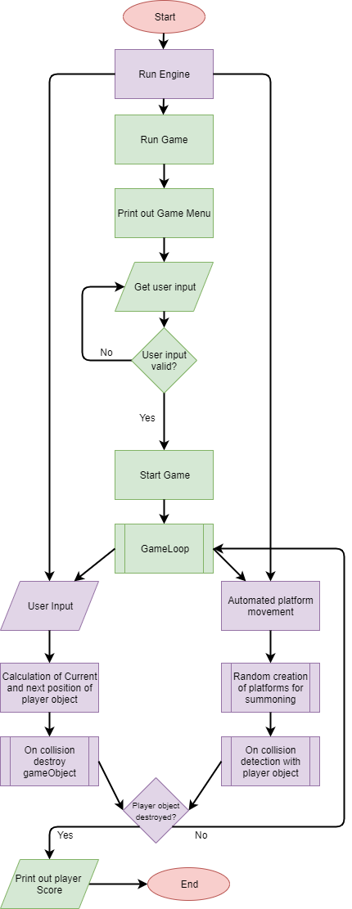
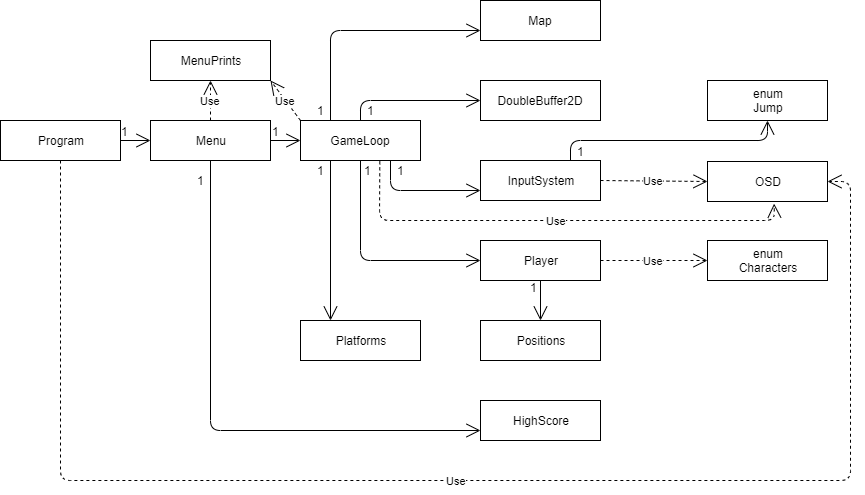

# LP2 Project 2

## Moon Buggy

### Authors

**Ana Dos Santos** - a21900297 [AnSantos99](https://github.com/AnSantos99)

**Catarina Matias** - a21801693 [StarryNight00](https://github.com/StarryNight00)

**Diana Levay** - a21801515 [nanilevay](https://github.com/nanilevay)

### Tasks of each group member

**Ana Dos Santos**
Changed visual aspects of game by adding colors and sound to the game. Setup of linux platform for testing purposes of the game on different platform. Designed UML class diagram and simple flowchart to show the programs functionality. Helped group members finding solutions for given problems by the program.

**Catarina Matias** (Menu (and its Prints and Exceptions); Score, HighScore and high score File handling; ReadMe report):

Responsible for the `Menu` logic and overall appearance of the menu information, `MenuPrints`. Also responsible for the user input, its Exceptions, and those on the mentioned classes.

Creation of the `Score` and `HighScore` classes, along with the file handling methods to save the high score information in-between program runs.

**Diana Levay** (Game Logic, Player and Platforms updates, Renders, Conditions for movements and game over):

Created, referenced and adapted the main logic for the gameloop, player, platforms and the display of each component on the screen, worked on fixing errors and finding exceptions throughout the program as well as creating the necessary methods for everything to work and look more like the original game (printing the game over over the game screen, help messages showing up at random, colours for each printed character), helped joining the score and menu logic along with Catarina with the working gameloop

Revision of documents and contributing to the organisation of the repository and writing the solution approach in the report.

Classes created and worked on: Player, DoubleBuffer2D (Directly based on the one given by the professor found in the references), Platforms, GameLoop, InputSystem (also based on professor's solution, modified accordingly to allow better adaptation to our game), Jump, Map, Positions, Characters
### Project's Git Repository

<https://github.com/StarryNight00/lp2_project2/tree/master>

### Describing Solution approach

We first approached this solution by following a logic that required GameLoop and Update methods, in order to function like a console game we also chose to use the DoubleBuffer approach taught by the professor with the necessary modifications to adapt to a Moon Buggy styled game.

The program begins by setting the console size and creating a Menu instance to call the IntroMenu() function and show the player a list of options to choose from. Here, the player's input will be read and they can exit the program, access the rules, see the highscores menu or beginning a new game, the Menu class accesses the MenuPrints static class in order to print the different menus and access them when needed.
If the player chooses to play the game, a new GameLoop class will be instantiated and started and we will enter the Loop(), where we'll create instances of Player, Platforms, a DoubleBuffer2D to store chars, a Map and and an input System. All components to be printed on the screen will be assigned positions inside their own classes in order to keep track of their movements for the updates.
In the game loop we constantly show the player information such as how to move, how to leave the game and some small help messages that were present in the original Moon Buggy, as well as constantly printing the player and Platforms (and some stars changing in the background, for visual effect) with different colours using the Console, that are constantly being Rendered on the screen via the DoubleBuffer.
We start the thread and set the player's motion to Idle (found in an enum with different states) and begin a while loop that will be active as long as our game is set to running (the losing conditions haven't been met nor has there been an ESCAPE key press on the input) followed by processing the player's input and sending it to the update, in order to change positions or show messages as they're due.
After, the Render method is called and this one will take all the chars given to the doublebuffer and will print them on the screen according to their position, character and colour, each getting defined within it's own class.
Finally the loop has a Thread.Sleep() method that allows us to control how we render the simulated time and how fast everything is happening.

If the player chooses to leave or loses the game we will exit the loop and print a game over screen, as well as sending the current score (measured by each successful jump) and send it to the HighScore class where it will be stored inside a .txt file and if the user chooses to see the scores a list of the top 10 scores will be displayed.

### Flow Chart

The following flowchart represents the basic structure of the program by separating the background functionalities of the Game Engine with the Game itself and how they come together.

### UML Diagram

The following class diagram represents associations between classes. The are only 3 Dependency arrows so the diagram stays simple to understand.

## References

The following references where used during this project.

**[1]** Class Power-points

**[2]** Code available at the File class C# API documentation was used as a stepping stone for the file handling in the program. - <https://docs.microsoft.com/en-us/dotnet/api/system.io.file?view=netframework-4.8>

**[3]** Re-used code from teachers solution from <https://github.com/VideojogosLusofona/lp2_2019_aulas.git> (Aula11, Exercise 3).

**[4]** Game logic based on the game Moon Buggy, Linux console edition found in <https://www.seehuhn.de/pages/moon-buggy>

**[5]** Referenced tutorial for initial logic intended for platforms and movement found it <https://www.youtube.com/watch?v=dXng0W0R_Ks>

**For Diagrams and FlowCharts:**

**[1]** The following site was used for both flowchart and UML class diagram.
<https://www.draw.io/>
